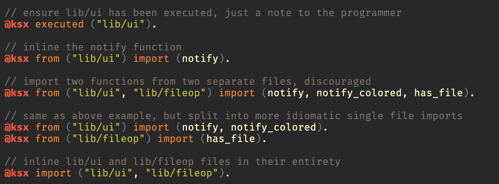
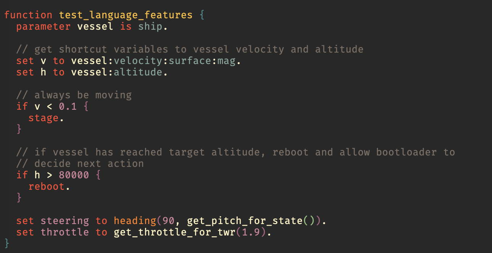

# kos-scripts

My scripts and supporting tools for the Kerbal Space Program (KSP) mod Kerbal
Operating System (kOS).

- [Kerbal Space Program on Steam](https://store.steampowered.com/app/220200/Kerbal_Space_Program/)
- [kOS Documentation](https://ksp-kos.github.io/KOS/)

Many ideas and implementation decisions taken from the excellent [Kerbal Space
Programming][kerbal-space-programming] series, you can find Kevin's [source code
repository here](https://github.com/gisikw/ksprogramming).

## Structure

All of the kOS code (KerboScript) is contained under the `source` folder. Within
this folder there are a few subdirectories, outlined below.

- *boot* - All of my bootloaders that can be executed whenever a kOSProcessor starts up, selectable in the VAB/SPH. See [Bootloaders](#bootloaders).
- *lib* - My personal library of KerboScript functions. Meant to be re-used across actions and missions.
- *actions* - One-off activities that are meant to be generic across vessels and generally too complex to be contained in a library.
- *missions* - Typically a composition of 'actions' as well as glue logic to piece them together. Can also be arbitrary KerboScript to run.
- *editor* - Editor specific files (for syntax highlighting)

Also at the top level is the `minified` folder, which contains a mirror of
everything in the `source` folder, but in 'minified' form so that it takes up
less disk space on the vessels. See the [Minification](#minification) section.
When you clone this repository, this folder will not contain any .ks files, they
must be generated by `ksx.py`.

The `Makefile` provides shortcuts for some commands I find myself using often,
it does not use very much 'make' magic so I don't feel the need to explain it
any further than that.

## KerboScript Extended (ksx-lang)

The base KerboScript language contains some shortcomings which make it non-ideal
for writing large and reliable software projects. The most obvious issue is
penalization of writing comments (disk size is limited, file sizes are just
character counts), but there are also some more subtle issues I have seen
starting to crop up.

Primarily, I find myself concerned by the following things:

- There is no import mechanism, think the `import` keyword in Python, `include`
  in C/C++, `use` in Rust, etc. All proper programming languages have a
  mechanism for supporting code modularization, but KerboScript does not.
- Due to disk space restrictions it is often best to write a series of scripts
  with an implicit assumption made about what other scripts have been previously
  executed. There is no standard way to document this expectation in a KerboScript file.
  - Yes you could put this information in a comment, but that tends to fade into the background
  - Additionally, making this assumption part of the language opens the door for
    actually compiling in a runtime check at some point in the future


*"KerboScript Extended" (ksx) Language Extensions*

This repository includes a tool `ksx.py` which is capable of transpiling .ksx
files into pure KerboScript, as well as performing minification of pure
KerboScript. The processes of [Transpilation](#transpilation) and
[Minification](#minification) are detailed below.

### Transpilation 

As ksx files contain instructions that the actual kOS processor does not
understand, you must transpile ksx files before loading them onto your vessel.
This can be done with the `ksx.py` tool. The transpilation rules are relatively
simplistic:

- `@ksx import (x).` - Find the file(s) `x` and inline them at this point.
- `@ksx from (x) import (y).` - Find the file(s) `x`, within all of those
  files ksx will then attempt to find each function(s) `y`. Each will be inlined
  in the reverse of the order in which they are listed.
- `@ksx executed (x).` - Runtime assertion that the file(s) `x` have been
  previously executed by this kOSProcessor. Currently this just transpiles into
  a comment.
- `@ksx *` - Any `@ksx` prefix statement not listed above will be transpiled to
  an empty line and removed from the final output.

The Makefile provides a target for performing transpilation (only transpilation,
no minification), this is useful for debugging compiled .ksx files and for
sharing your scripts with others who are not using ksx-lang.

```
make transpile-only-all
```

This is equivalent to invoking ksx.py directly in the following way;

```
python3 ksx.py --nuke ---transpile-only --all-files --include=source/
```

### Minification

kOS limits the amount of disk space you have available on any given ship, this
disk space usage is calculated by doing a character count on all of the files
loaded onto the disk. For .ks files this includes comments and all sorts of
other unnecessary characters.

This is unfortunate because it discourages at least the following, which are
generally good for making software:

1. Discourages detailed comments (or really, any comments at all)
2. Discourages descriptive variable and function names

I don't like working with those restrictions, but can only do so much to work
around it. It is possible at least to post-process the .ks files to work within
the allowance of the kOS grammar to crunch the source files. That is exactly
what the `ksx.py` script does and there are companion targets in the Makefile
to help with it.

Primarily, you will want to compile all of the files (this will transpile any 
ksx files to pure ks, and then minify):

```base
make compile-all
```

You may be wondering, why not just [compile the .ks files into .ksm][doc-compile-ksm]
and I have one responses to that I tried doing it and it has *a lot* of
overhead. In some cases the .ksm files I would end up with would actually be
larger than the .ks files that I started with, and at least in what I have seen
so far the .ksm files are always larger than my minified files.

## Bootloaders

There are three types of bootloaders supported.

- *shell* - The simplest bootloader, just executes `bootstrap` and opens the terminal window. 
- *beacon* - A fairly lightweight bootloader that bootstraps and then waits for update files to be pushed from mission control. Very much inspired by [Kerbal Space Programming][kerbal-space-programming].
  - This is my most commonly used bootloader
- *gui* - A pretty heavy bootloader that opens up a custom graphical user interface (GUI). The intent is for this UI to be able to guess what you would want to do at any given time and only show the relevant options, allowing for configuration when necessary.
  - This is not quite mission ready.
  - This is heavy, and I recommend only using it on vessels with large disk sizes.

## Actions vs. Missions

My primary workflow for controlling vessels through kOS is as follows:

1. Set vessel to use `beacon` bootloader
2. (optional) Develop a mission script for the task I am trying to accomplish. This really depends on the level of complexity or strictness of the timing requirements for what I am trying to do.
3. Use `make push-action ...` and `make push-mission ...` to transfer actions/missions to the vessel. Wash, rinse, repeat.
4. Do a post-mortem to decide which `actions` would be most useful in the future to more easily glue together full missions

### Action Example

An action `blinky` can be pushed to the vessel named `kostest` with the
following command on the host machine (i.e. not in a kOS terminal, but from the
kos-scripts repo on your machine).

```bash
make push-action ACTION=blinky TARGET=name-kostest
```

This copies (a minified version of) the file `source/action/blinky.ks` from the
`kos-scripts` repository into the actual Ship/Scripts folder inside KSP, and
renames it so that the `TARGET` vessel can detect that the update is meant for
it. Exactly how this works is in flux, see [Beacon Update File
Targeting](#beacon-update-file-targeting).

### Mission Example

A mission `test-airstream` can be pushed to the vessel with uuid `5327904214`
with the following command on the host machine (i.e. not in a kOS terminal, but
from the kos-scripts repo on your machine).

```bash
make push-mission MISSION=test-airstream TARGET=uuid-5327904214
```

This copies (a minified version of) the file `source/mission/test-airstream.ks`
from the `kos-scripts` repository into the actual Ship/Scripts folder inside
KSP, and renames it so that the `TARGET` vessel can detect that the update is
meant for it. Exactly how this works is in flux, see [Beacon Update File
Targeting](#beacon-update-file-targeting).

## Beacon Update File Targeting

**TODO**: I will document this at some point, but I am considering an overhaul
to this whole system pretty soon so I don't want to do that just now.

## Emacs Major Mode (ksx-mode)

This repository (under the `editor`) folder contains an emacs major mode for
editing KerboScript. It actually is intended to support some language extensions
I want to add and am referring to as KerboScript Extended, hence the name
ksx-mode.


*Spacemacs with [gruvbox theme][gruvbox-theme] and [Fira Code font][fira-code]* 

This mode was originally derived from [jarpy/kos-mode][jarpy-kos-mode] but has
been improved in several ways since forking. It supports:

- Highlighting for KerboScript keywords, built-in functions, constants, and numbers.
  - Derived from kos-mode, but extended
- Highlighting for known object suffixes such as `SHIP:VELOCITY:ORBIT`.
  - Derived from kos-mode, but extended
- Powerful and automatic indentation. Try `ks-indent-buffer`.
  - Derived from kos-mode, extended to enable autopairing of braces and
    parentheses (by deriving from prog-mode instead of fundamental mode)
- Proper comment wrapping (`fill-region`, `fill-paragraph`, etc.) for long comments.

### Installation

KerboScript Extended is and always will be a strict superset of KerboScript so
you can use this mode for pure KerboScript as well. If you would like to do so,
you can download the [editor/ksx.el][ksx-el-blob] file, place it on your machine
somewhere (this example assumes `/emacs-custom/`) then add the following to your
`init.el`:

```elisp
(add-to-list 'load-path "~/emacs-custom/ksx.el")
(require 'ksx)
```

## Screenshot Highlighting Code

The screenshot shown above for demonstrating `ksx-mode` is highlighting the
following code block.

```
function test_language_features {
  parameter vessel is ship.

  // get shortcut variables to vessel velocity and altitude
  set v to vessel:velocity:surface:mag.
  set h to vessel:altitude.

  // always be moving
  if v < 0.1 {
    stage.
  }

  // if vessel has reached target altitude, reboot and allow bootloader to
  // decide next action
  if h > 80000 {
    reboot.
  }

  set steering to heading(90, get_pitch_for_state()).
  set throttle to get_throttle_for_twr(1.9).
}
```

The screenshot shown above for demonstrating the `ksx-lang` language extensions
and `ksx-mode` is highlighting the following code block.

```
// ensure lib/ui has been executed, just a note to the programmer
@ksx executed ("lib/ui").

// inline the notify function
@ksx from ("lib/ui") import (notify).

// import two functions from two separate files, discouraged
@ksx from ("lib/ui", "lib/fileop") import (notify, notify_colored, has_file).

// same as above example, but split into more idiomatic single file imports
@ksx from ("lib/ui") import (notify, notify_colored).
@ksx from ("lib/fileop") import (has_file).

// inline lib/ui and lib/fileop files in their entirety
@ksx import ("lib/ui", "lib/fileop").
```

[kerbal-space-programming]: https://www.youtube.com/watch?v=fNlAME5eU3o&list=PLb6UbFXBdbCrvdXVgY_3jp5swtvW24fYv
[doc-compile-ksm]: https://ksp-kos.github.io/KOS/general/compiling.html
[jarpy-kos-mode]: https://github.com/jarpy/ks-mode
[ksx-el-blob]: https://github.com/leonardmh/kos-scripts/raw/master/editor/ksx.el
[gruvbox-theme]: https://github.com/greduan/emacs-theme-gruvbox 
[fira-code]: https://github.com/tonsky/FiraCode 
